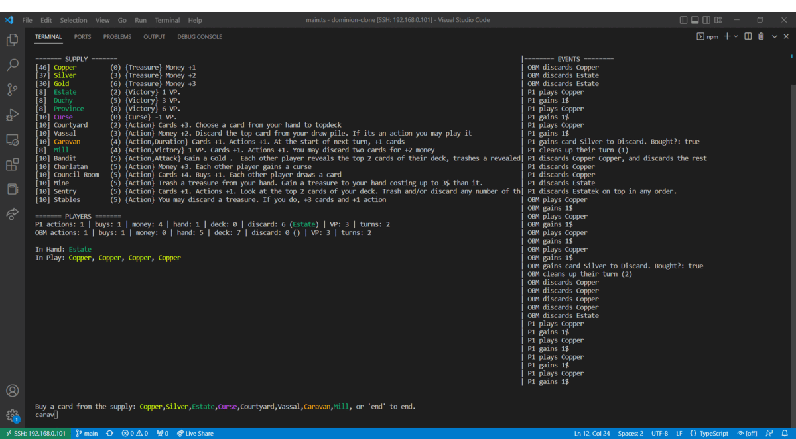

# Dominion Clone

A terminal-based dominion clone.
Supporting the 2nd edition sets (Base, Intrigue, Seaside, Prosperity, Hinterlands)

## Gameplay

### Debugging
You can attach a debugger similar to other nodejs applications
run `node --inspect dist/src/main.js` 
and then go to `chrome://inspect` and attach the debugger.

(You have to do it this way so that stdout still goes to the console, otherwise it will crash when it tries to 
render the ui)